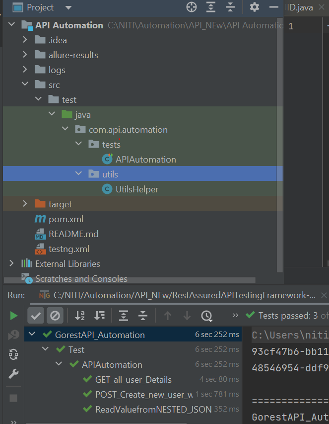

API Automation Readme
This readme file provides information on how to set up and run the API automation tests for the project.
I have used API automation framework with the help of below technology:
-	Java
-	Rest Assured
-	TestNG

Prerequisites
Below software must installed on the system
-	Java Development Kit (JDK) installed
-	Maven installed
-	API endpoint details (base URL, authentication details, etc.)
-	TestNG

How to setup:
1.	Clone the repository:
    a.	git clone https://github.com/Tecniti/Automation-API.git
2.	Install project dependencies
    a.	Open POM.xml and load all the dependencies

Running the Testcase
1.	To run the API automation tests, Do the following
    a.	Right Click on the testng.xml file
    b.	Click on “run as testng.xml”

Test Reports
After running the tests, the Allure reports will be generated in the allure-result folder. After running your tests, navigate to the project's root directory and execute the following command to generate the Allure report:
	allure serve allure-results

Explanation of the Project Structure
1. Included all the dependencies under pom.xml, which is required to import the library in the class.
2. Provide the initial class “com.api.automation.tests.APIAutomation” at testing.xml, which is the starting point of the project.
3. Provide the testreport plugin in the APIAutomation class for reporting
4. Wrote all the testcases under the APIAutomation class by using testNG. Testcases are using GET and POST API and included testcases in the project are:- 
   1. "[POST + Authentication] Create a user based on different email ID with authentication 
   2. Get]Running Get API and validating the status code
   3. "[Fetch data from Nested Structure] Verify Created user from the response of GEt API.
5. Putted all the method in the UtilsHelper class, which are using in APIAutomation.
6. Here is my project structure screenshot.

